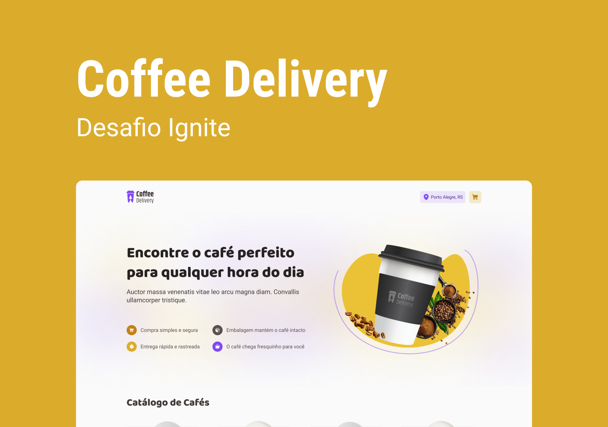

<p align="center">
   <a href="https://www.linkedin.com/in/arilsonsouza/">
      
   </a>

  
</p>

> Segundo desafio da trilha de React do Ignite - 2022 da [Rocketseat](https://github.com/Rocketseat). Durante este desafio, utilizamos conceitos um pouco mais avançados desenvolvendo do zero uma aplicação de encomenda de cafés! A aplicação conta com 3 telas sendo a primeira uma tela de apresentação e também de listagem dos cafés disponíveis. Na segunda tela, o usuário precisa preencher um formulário com seus dados de endereço e ao lado direito é possível visualizar os itens do carrinho, podendo alterar a quantidade ou remover o mesmo. Na terceira e última tela, é exibido uma confirmação do pedido e também os detalhes de entrega da compra.



# :pushpin: Conteúdo

- [Tecnologias](#computer_tecnologias)
- [Executando](#construction_worker-executando)

# :computer: Tecnologias

Este projeto foi feito utilizando as seguintes tecnologias:

- Vite
- Styled Components
- Local Storage
- Typescript
- Context API
- React Router Dom
- React Hook Form
- Validações de formulário com Zod
# :construction_worker: Executando

```bash
# Clone o Repositório
git clone https://github.com/arilsonsouza/coffee-delivery.git
```

```bash
# Baixe as dependendências
$ yarn
```

```bash
# Execute
$ yarn dev
```

Acesse <http://localhost:3000> para ver o resultado.
